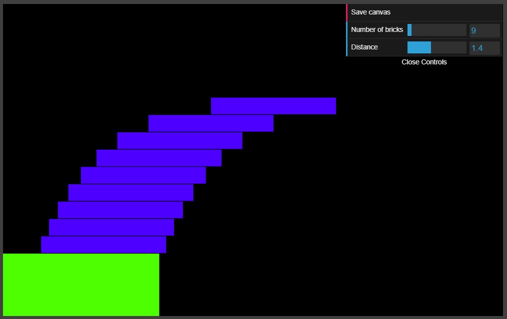

# Bricks

It demonstrates the solution to the famous Block-stacking problem:
Place N identical rigid rectangular blocks in a stable stack on a table edge in such a way as to maximize the overhang.

The suprising fact is that the overhang diverges as the number of bricks approaches infinity.

